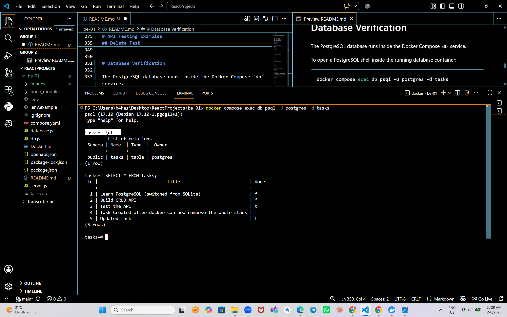

# A3: Containerize Your Stack

This project runs a Task CRUD API with PostgreSQL as the database backend.

The complete application stack is containerized using Docker and Docker Compose. A single command starts both the API server and database:

```bash
docker compose up
```

The API behaviour remains unchanged while the storage layer runs on a real PostgreSQL database inside Docker.

---

## Architecture

```
Client
   |
   v
Express API Container
   |
   v
PostgreSQL Database Container
   |
   v
Docker Volume (Persistent Storage)
```

---

# Features

- Express.js REST API
- PostgreSQL database integration
- Dockerized application
- Docker Compose multi-container setup
- Environment variable based configuration
- Automatic database table creation
- Seed data inserted only on first run
- Parameterized SQL queries
- Full CRUD operations
- Input validation
- Swagger UI for user friendly API testing
- OpenAPI Specification
- Persistent database storage using Docker volumes

---

# Technologies Used

- Node.js
- Express.js
- PostgreSQL 17
- Docker (pre-requisite before testing the repo)
- Docker Compose
- node-postgres (`pg`)
- Swagger UI Express
- OpenAPI Specification

---

# Project Structure

```
be-01/
│
├── server.js              # Express API server
├── database.js            # PostgreSQL queries and initialization
├── db.js                  # PostgreSQL connection pool
│
├── Dockerfile             # API container image definition
├── compose.yaml           # API + PostgreSQL services
│
├── .env                   # Local environment variables (ignored)
├── .env.example           # Environment template
├── .gitignore
│
├── openapi.json            # Swagger documentation
├── package.json
├── package-lock.json
│
├── images/
│   ├── postgres-table.png
│
└── README.md
```

---

# Environment Setup

Database credentials are stored using environment variables.

The real `.env` file is ignored by Git and never committed.

Create your local environment file:

```bash
cp .env.example .env
```

Example:

```env
POSTGRES_USER=postgres
POSTGRES_PASSWORD=your_password
POSTGRES_DB=tasks
DATABASE_URL=postgres://postgres:your_password@db:5432/tasks
```

## Environment Variables

| Variable | Purpose |
|---|---|
| `POSTGRES_USER` | PostgreSQL username |
| `POSTGRES_PASSWORD` | PostgreSQL password |
| `POSTGRES_DB` | Database name |
| `DATABASE_URL` | Connection string used by the API |

---

# Running the Application

## Install and Setup the Docker
You may cross-check the right installation with the following command:

```bash
docker --version
```

---


## Clone Repository

```bash
git clone <repository-url>

cd be-01
```

---

## Install Dependencies

Optional for local development:

```bash
npm install
```

---

## Start Complete Stack

Run:

```bash
docker compose up
```

Docker starts:

- Express API container
- PostgreSQL database container

---

## API URL

```
http://localhost:3000
```

## Swagger Documentation

```
http://localhost:3000/docs
```

---

# PostgreSQL Database

PostgreSQL runs using:

```
postgres:17
```

The database is automatically initialized when the API starts.

The application creates the table:

```sql
CREATE TABLE IF NOT EXISTS tasks (
    id SERIAL PRIMARY KEY,
    title TEXT NOT NULL,
    done BOOLEAN DEFAULT FALSE
);
```

---

# Database Persistence

PostgreSQL data is stored using a Docker named volume:

```yaml
volumes:
  taskdata:
```

The volume keeps database records even when containers are restarted.

Example:

```bash
docker compose down

docker compose up
```

Created tasks remain available after restarting the stack.

---

# Seed Data

On the first startup, the application inserts example tasks only when the table is empty.

Example:

```json
[
  {
    "id": 1,
    "title": "Learn PostgreSQL (switched from SQLite)",
    "done": false
  },
  {
    "id": 2,
    "title": "Build CRUD API",
    "done": false
  },
  {
    "id": 3,
    "title": "Test the API",
    "done": true
  }
]
```

Restarting the application does not create duplicate rows.

---

# API Endpoints

| Method | Endpoint | Description |
|---|---|---|
| GET | `/` | API information |
| GET | `/health` | Health check |
| GET | `/tasks` | Get all tasks |
| GET | `/tasks/:id` | Get task by ID |
| POST | `/tasks` | Create task |
| PUT | `/tasks/:id` | Update task |
| DELETE | `/tasks/:id` | Delete task |

---

# API Testing Examples

## Get All Tasks

Request:

```bash
curl -i http://localhost:3000/tasks
```

Response:

```json
[
  {
    "id": 1,
    "title": "Build CRUD API",
    "done": false
  }
]
```

---

## Create Task

Request:

```bash
curl -X POST http://localhost:3000/tasks \
-H "Content-Type: application/json" \
-d "{\"title\":\"Learn Docker\"}"
```

Response:

```
201 Created
```

---

## Update Task

Request:

```bash
curl -X PUT http://localhost:3000/tasks/1 \
-H "Content-Type: application/json" \
-d "{\"title\":\"Completed Task\",\"done\":true}"
```

Response:

```
200 OK
```

---

## Delete Task

Request:

```bash
curl -X DELETE http://localhost:3000/tasks/1
```

Response:

```
204 No Content
```

---

# Database Verification

The PostgreSQL database runs inside the Docker Compose `db` service.

To open a PostgreSQL shell inside the running database container:

```bash
docker compose exec db psql -U postgres -d tasks
```

## View Tables

```sql
\dt
```

## View Data

```sql
SELECT * FROM tasks;
```
You may experiment with other SQL queries like INSERT, UPDATE, DELETE to play with the database.

## Exit PostgreSQL Shell
```sql
\q
```

## Database Table Screenshot




---

# Migration History

## Assignment 1

Tasks were stored temporarily in application memory.

```
Client → Express API → Memory
```

Data disappeared after application restart.

---

## Assignment 2

Storage moved to SQLite.

```
Client → Express API → SQLite (tasks.db)
```

Data persisted locally using a database file.

---

## Assignment 3

Storage moved to PostgreSQL running inside Docker.

```
Client → Express API → PostgreSQL Container
```

The API contract remained unchanged while the storage layer moved to a production-style database server.

---

# Requirements Checklist

Completed:

✅ PostgreSQL runs inside Docker container  
✅ Complete stack starts with one command:

```bash
docker compose up
```

✅ API connects using `DATABASE_URL`  
✅ Database credentials are stored in `.env`  
✅ `.env` is ignored by Git  
✅ `.env.example` is committed  
✅ No hardcoded database credentials  
✅ PostgreSQL database is created automatically  
✅ Tasks table is created automatically  
✅ Example tasks are seeded only once  
✅ GET `/tasks` works  
✅ GET `/tasks/:id` works  
✅ POST `/tasks` works  
✅ PUT `/tasks/:id` works  
✅ DELETE `/tasks/:id` works  
✅ Parameterized SQL queries are used  
✅ Correct HTTP status codes implemented:

```
200 OK
201 Created
204 No Content
400 Bad Request
404 Not Found
```

✅ PostgreSQL data persists after:

```bash
docker compose down
docker compose up
```

✅ README contains setup instructions  
✅ README contains endpoint documentation
✅ README contains database verification instructions  
✅ README contains PostgreSQL screenshots  